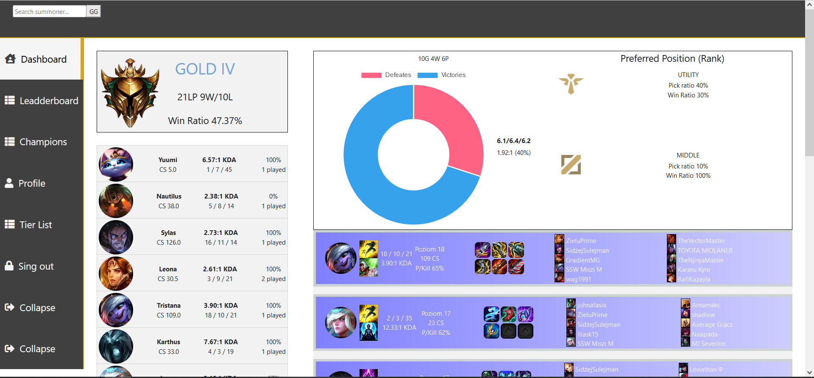
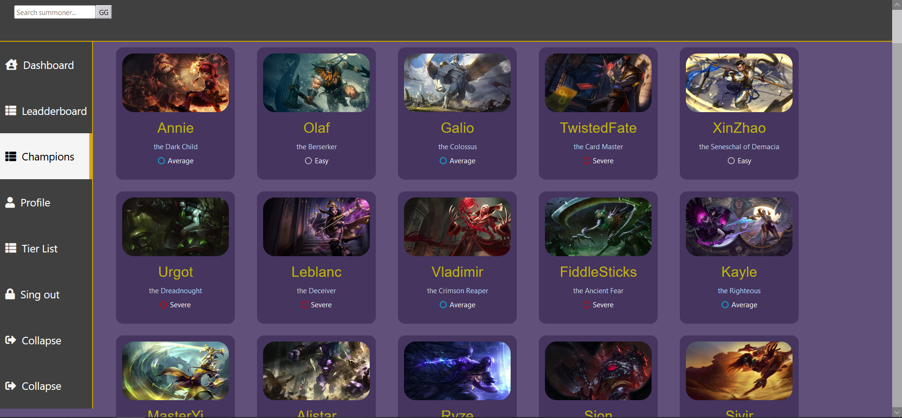

# League of Legends Data App
Technology in use : [Java, Spring Boot, React.js, HTML5, CSS, Bootstrap, SQL, T-SQL, JPA, Junit, Mockito]  
The aim of the project to build an application to analyze matches in League of Legends, statistical data about champions, their builds, items, perks and so on. The application provides insight of player's performance in general (overall performance) and in every game.

How does it work?
All the data is retrieved from Riot's API. In the matter of a Riot's API limitations (200 requests per minute) the data is stored and taken from database. Due to those restrictions user have to manually refresh the data using button. Moreover Riot's API doesnt allow us to fetch more than last 50 matches. That's another reason why we have to store the data. I don't think we can come to any valuable conclusion having not enough informations.  
In general application is suppose to be supportive in a process of decision-making. Since Riot doesn't provide statistical data - just 'basic' information about match, we need to prepare data as first. 

End-points / Current Feature:\
	&emsp;Match:\
	&emsp;&emsp;GET /api/v1/match/championStats/{nickname} - returns DTOs with champion performances for a summoner\
	&emsp;&emsp;GET /api/v1/match/details/{nickname} - returns DTOs with last matches\
	&emsp;&emsp;GET /api/v1/match/rolePreferences/{nickname} - prefered role based on last games\
	&emsp;&emsp;GET /api/v1/match/refresh/{nickname} - refreshes avaiable champions\
	&emsp;&emsp;GET /api/v1/match/refresh/challengers - refreshes data collection with challengers matches\
	&emsp;Perk:\
	&emsp;&emsp;GET /api/v1/perk/mainTree/{championName} - returns DTO with most popular perk tree based on last matches\
	&emsp;&emsp;GET /api/v1/perk/subTree/{championName} - returns DTO with most popular sub tree (based on main tree) based on last matches\
	&emsp;&emsp;GET /api/v1/perk/refresh - refreshes data about available perk trees\
	&emsp;Item:\
	&emsp;&emsp;GET /api/v1/item/refresh - refreshes data about avaiable items\
	&emsp;&emsp;GET /api/v1/item/mostPopular/{championName} - returns most popular Items for a champion (always returns boots (one pair))\
	&emsp;Summoner:\
	&emsp;&emsp;GET /api/v1/summoner/{nickname} - returns DTO with needed summoner data\
	&emsp;&emsp;GET /api/v1/summoner/league/{nickname} - returns DTO with needed summoner's league\
	&emsp;Champion:\
	&emsp;&emsp;GET /api/v1/champion/refresh - refreshes avaiable champions\
	&emsp;&emsp;GET /api/v1/champion/strongAganist/{championName} - returns 3 champions that has lowest win ratio aganist chosen champion\

Future feature:\
&emsp;Security\
&emsp;Graphs with performance based on chosen role and related matches (Gonna try out Strategy pattern)\

Table Schema\
