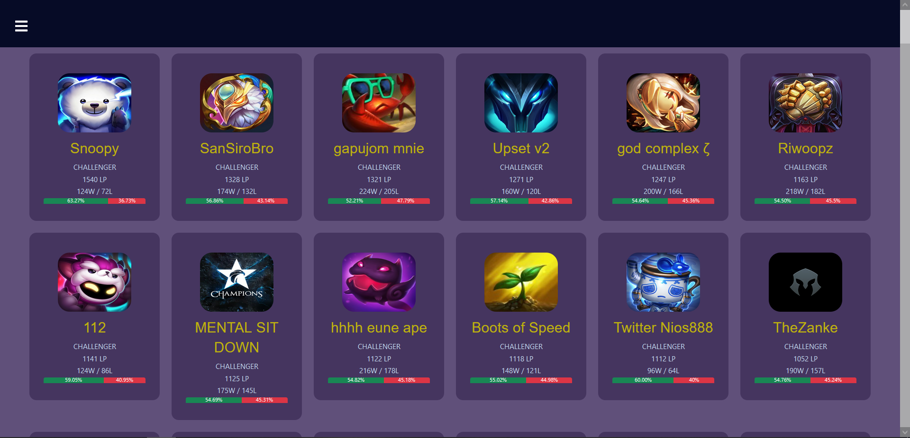

# League of Legends Data App
Technology in use : [Java, Spring Boot, React.js, HTML5, CSS, Bootstrap, SQL, T-SQL, JPA, Junit, Mockito]  
The goal of the project is to build an application to analyze matches in League of Legends, statistic data of champions, their builds, items, perks and so on. The application provides insight of player's performance in general (overall performance) and in every signle game.

How does it work?

Most of the data comes from Riot's API. Unfortunately, Riot's API does not provide information about player's performance, just the data like how many wards u put on the map, what champion was banned in this game or dealt damage. Also, the Riot's API limitations are crucial, only 200 requests per minute and to display one page is needed about 4 request. That's why all the data cannot be retrieved and displayed with ReactsJS, we need a database to store information. In order to collect most valuable data (highest placed players) there's created a thread to repeatedly refresh data of those players' matches. All the others players results have to be refreshed with button on page. Due to low efficiency retrieving the whole table schema to get data of the most popular perk tree, items or strong/weak champion against there are T-SQL scripts that have to be scheduled and fill the separate entities what reduces the complexity and the time needed to retrieve records and processing it afterwards. In general application is supposed to be supportive in a process of decision-making. Since Riot doesn't provide statistical data - just 'basic' information about match, we need to prepare it yourself as first.

End-points / Current Feature:\
	&emsp;Match:\
	&emsp;&emsp;GET /api/v1/match/championStats/{nickname} - returns DTOs with champion performances for a summoner\
	&emsp;&emsp;GET /api/v1/match/details/{nickname} - returns DTOs with last matches\
	&emsp;&emsp;GET /api/v1/match/rolePreferences/{nickname} - prefered role based on last games\
	&emsp;&emsp;GET /api/v1/match/refresh/{nickname} - refreshes avaiable champions\
	&emsp;&emsp;GET /api/v1/match/refresh/challengers - refreshes data collection with challengers matches\
	&emsp;Perk:\
	&emsp;&emsp;GET /api/v1/perk/mainTree/{championName} - returns DTO with most popular perk tree based on last matches\
	&emsp;&emsp;GET /api/v1/perk/subTree/{championName} - returns DTO with most popular sub tree (based on main tree) based on last matches\
	&emsp;&emsp;GET /api/v1/perk/refresh - refreshes data about available perk trees\
	&emsp;Item:\
	&emsp;&emsp;GET /api/v1/item/refresh - refreshes data about avaiable items\
	&emsp;&emsp;GET /api/v1/item/mostPopular/{championName} - returns most popular Items for a champion (always returns boots (one pair))\
	&emsp;Summoner:\
	&emsp;&emsp;GET /api/v1/summoner/{nickname} - returns DTO with needed summoner data\
	&emsp;&emsp;GET /api/v1/summoner/league/{nickname} - returns DTO with needed summoner's league\
	&emsp;Champion:\
	&emsp;&emsp;GET /api/v1/champion/refresh - refreshes avaiable champions\
	&emsp;&emsp;GET /api/v1/champion/strongAganist/{championName} - returns 3 champions that has lowest win ratio aganist chosen champion\

Future feature:\
&emsp;Security\
&emsp;Graphs with performance based on chosen role and related matches (Gonna try out Strategy pattern)\

Table Schema\
